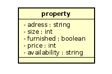
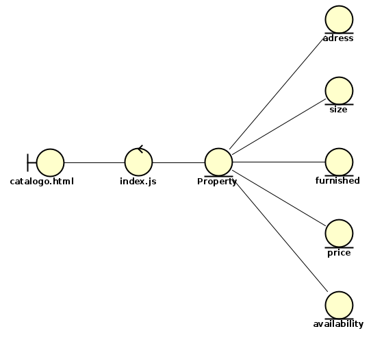
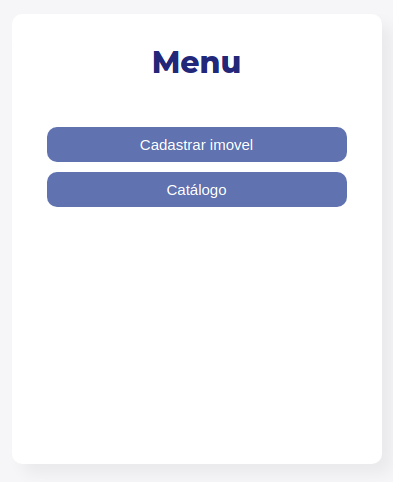
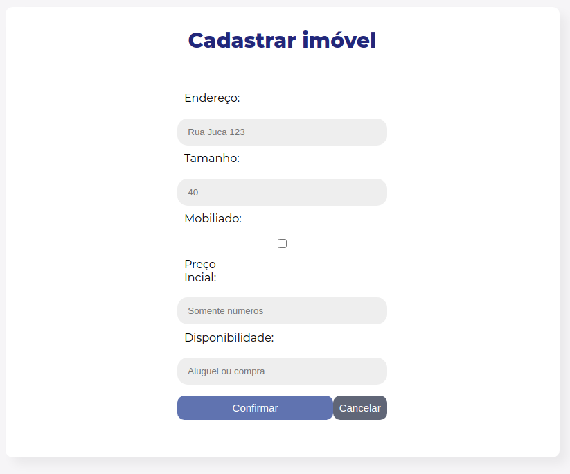
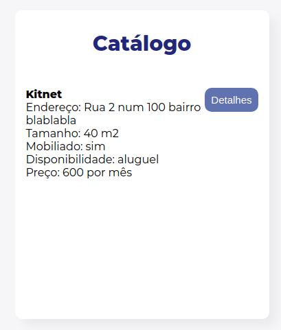

## Caso de Uso 2

Responsável: Arthur Nogueira - 213293

Funcionalidade:  Solicitar compra ou aluguel de imóvel

Nesse caso dee uso o usuário enttra no catálogo da imobiliária, acessa a página do imóvel e solicita a compra ou aluguel

## Design das Interfaces Gráficas

O grupo optou por seguir a seguinte paleta de cores durante o desenvolvimento dos casos de uso: [Paleta de Cores](https://www.schemecolor.com/purple-blue.php)

A fonte utilizada foi a ```Montserrat```

## Pré-condições necessárias

As pré-condições necessárias para esse caso de uso são:

* index.html: implementa página inicial que direciona o usuário para a página responsável pela inicialização do caso de uso
* index.js: implementa funções necessárias para funcionamento correto do caso de uso
* catalogo.html: página responsável por viabilizar que usuário solicite a compra ou o aluguel de imóveis

## Design do Banco de Dados

O banco de dados é implementado da seguinte maneira:

```
{
  adress: String,
  size: Number,
  furnished: Boolean,
  price: Number,
  availability: String
}
```

Abaixo, segue o diagrama de classes que implementa o banco de dados:



## Design do Repertório de Objetos

O diagrama que representa o design do repertório de objetos:



## Execução do Caso de Uso

Para executar esse caso de uso, é necessário que o usuário execute os seguntes comandos:

```
  cd App
  chmod ugo+x mongo.sh node.sh start.sh
  ./start
```

E, em seguida, digitar o seguinte na URL de seu navegador de preferência:

```
  http://localhost:3000/
```

Ao clicar em `Catálogo`, o usuário é direcionado para a página que executa o caso de uso uc2.

## Prints de Tela do Aplicativo




